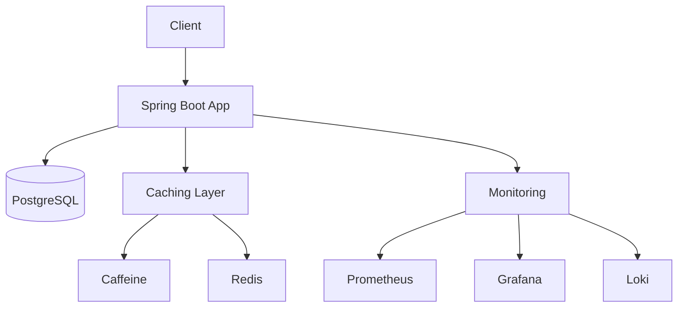

# **Project Tracker Application**  
**A Comprehensive Task & Project Management System with Advanced Monitoring**  

  
  
  
  
  
  

---

## **📌 Table of Contents**  
1. [**Overview**](#-overview)  
2. [**Key Features**](#-key-features)  
3. [**System Architecture**](#-system-architecture)  
4. [**Prerequisites**](#-prerequisites)  
5. [**Installation & Setup**](#-installation--setup)  
6. [**Configuration (application.properties)**](#-configuration-applicationproperties)  
7. [**API Documentation**](#-api-documentation)  
8. [**Monitoring & Observability**](#-monitoring--observability)  
9. [**Security**](#-security)  
10. [**Deployment**](#-deployment)  
11. [**Troubleshooting**](#-troubleshooting)  
12. [**Contributing**](#-contributing)  
13. [**License**](#-license)  

---

## **🌐 Overview**  
A **high-performance** project and task management system built with **Spring Boot**, featuring:  
✅ **Role-based access control** (Admin, Manager, Developer, Contractor)  
✅ **Multi-layer caching** (Caffeine + Redis) for optimal performance  
✅ **Real-time monitoring** with **Prometheus, Grafana, and Loki**  
✅ **JWT + OAuth2** authentication  
✅ **Actuator endpoints** for health checks, metrics, and cache management  

---

## **✨ Key Features**  

### **📊 Core Functionality**  
✔ **Project Management** – Create, update, and track projects  
✔ **Task Tracking** – Assign tasks, set deadlines, and monitor progress  
✔ **User Management** – Role-based permissions (Admin, Manager, Developer, Contractor)  

### **⚡ Performance & Caching**  
✔ **Caffeine Cache** – In-memory caching for fast data access  
✔ **Redis Integration** – Distributed caching for scalability  
✔ **Cache Eviction Policies** – TTL and size-based eviction  

### **📈 Monitoring & Observability**  
✔ **Prometheus** – Collects and stores metrics  
✔ **Grafana** – Visualization dashboards for performance tracking  
✔ **Loki** – Centralized logging for debugging  
✔ **Micrometer Metrics** – Exposes JVM, cache, and custom metrics  

### **🔒 Security**  
✔ **JWT Authentication** – Secure API access  
✔ **OAuth2 Support** – Google/GitHub login integration  
✔ **Role-Based Access Control (RBAC)** – Fine-grained permissions  
✔ **Audit Logging** – Tracks user actions for security compliance  

---

## **🏗 System Architecture**  



---

## **📋 Prerequisites**  
- **Java 17**  
- **Docker** (for monitoring stack)  
- **PostgreSQL** (or another supported DB)  
- **Redis** (optional, for distributed caching)  

---

## **🛠 Installation & Setup**  

### **1. Clone the Repository**  
```bash
git clone https://github.com/yourusername/project-tracker.git
cd project-tracker
```

### **2. Configure the Application**  
Edit `src/main/resources/application.properties`:  
```properties
# Database Configuration
spring.datasource.url=jdbc:postgresql://localhost:5432/project_tracker
spring.datasource.username=your_db_user
spring.datasource.password=your_db_password
spring.jpa.hibernate.ddl-auto=update

# Cache Configuration
spring.cache.type=caffeine
spring.cache.caffeine.spec=maximumSize=1000,expireAfterWrite=30m,recordStats
spring.cache.redis.time-to-live=1h

# Actuator & Metrics
management.endpoints.web.exposure.include=health,metrics,prometheus,caches
management.endpoint.prometheus.enabled=true
management.metrics.export.prometheus.enabled=true
```

### **3. Build & Run**  
```bash
./mvnw spring-boot:run
```

### **4. (Optional) Start Monitoring Stack**  
```bash
docker-compose -f docker-compose-monitoring.yml up -d
```
Access:  
- **Grafana**: `http://localhost:3000` (admin/admin)  
- **Prometheus**: `http://localhost:9090`  
- **Loki (Logs)**: `http://localhost:3100`  

---

## **⚙ Configuration (`application.properties`)**  

### **📌 Database & JPA**  
```properties
spring.datasource.url=jdbc:postgresql://localhost:5432/project_tracker
spring.datasource.username=postgres
spring.datasource.password=postgres
spring.jpa.hibernate.ddl-auto=update
spring.jpa.show-sql=true
```

### **📌 Caching**  
```properties
# Caffeine (In-Memory)
spring.cache.type=caffeine
spring.cache.caffeine.spec=maximumSize=1000,expireAfterWrite=30m,recordStats

# Redis (Distributed)
spring.cache.redis.time-to-live=1h
spring.redis.host=localhost
spring.redis.port=6379
```

### **📌 Monitoring & Actuator**  
```properties
# Prometheus Metrics
management.endpoints.web.exposure.include=health,metrics,prometheus,caches
management.endpoint.prometheus.enabled=true
management.metrics.export.prometheus.enabled=true

# Enable Cache Metrics
management.metrics.enable.caffeine=true
```

### **📌 Security (JWT & OAuth2)**  
```properties
# JWT Configuration
jwt.secret=your-secret-key
jwt.expiration=86400000 # 24h

# OAuth2 Google
spring.security.oauth2.client.registration.google.client-id=your-client-id
spring.security.oauth2.client.registration.google.client-secret=your-client-secret
```

---

## **📚 API Documentation**  
Access **Swagger UI** at:  
🔗 `http://localhost:8080/swagger-ui.html`  

---

## **📊 Monitoring & Observability**  

### **📌 Pre-configured Dashboards**  
1. **Application Performance** – Request rates, error rates, latency  
2. **Cache Metrics** – Hit/miss ratios, evictions  
3. **Task Processing** – Execution times, throughput  

### **📌 Alerting Rules**  
Alerts configured in `prometheus/alerts.yml`:  
- **High Error Rate** (>10% 5xx responses)  
- **Cache Performance Degradation** (High miss rate)  

---

## **🔒 Security**  
- **JWT Authentication** – Secure API endpoints  
- **OAuth2** – Google/GitHub login  
- **Role-Based Access** – Admin, Manager, Developer, Contractor  
- **Audit Logging** – Tracks critical actions  

---

## **🚀 Deployment**  

### **Docker**  
```bash
docker build -t project-tracker .
docker run -p 8080:8080 project-tracker
```

### **Kubernetes (Sample)**  
```bash
kubectl apply -f k8s/deployment.yaml
kubectl apply -f k8s/service.yaml
```

---

## **🛠 Troubleshooting**  
| Issue | Solution |
|-------|----------|
| Cache not working? | Check `spring.cache.type` in `application.properties` |
| Prometheus not scraping? | Verify `management.endpoints.web.exposure.include` includes `prometheus` |
| JWT not working? | Ensure `jwt.secret` is set in `application.properties` |

---

## **🤝 Contributing**  
1. Fork the repository  
2. Create a feature branch (`git checkout -b feature/xyz`)  
3. Commit changes (`git commit -m "Add feature xyz"`)  
4. Push to branch (`git push origin feature/xyz`)  
5. Open a **Pull Request**  

---

## **📜 License**  
This project is licensed under the **MIT License**. See [LICENSE](LICENSE) for details.  

---

## **📞 Support**  
For issues, feature requests, or questions:  
📧 **Email**: support@codewithzea.com  
🐞 **GitHub Issues**: [Open an Issue](https://github.com/yourusername/project-tracker/issues)  

---

### **🚀 Happy Coding!**  
Developed with ❤️ by **CodeWithZea**
