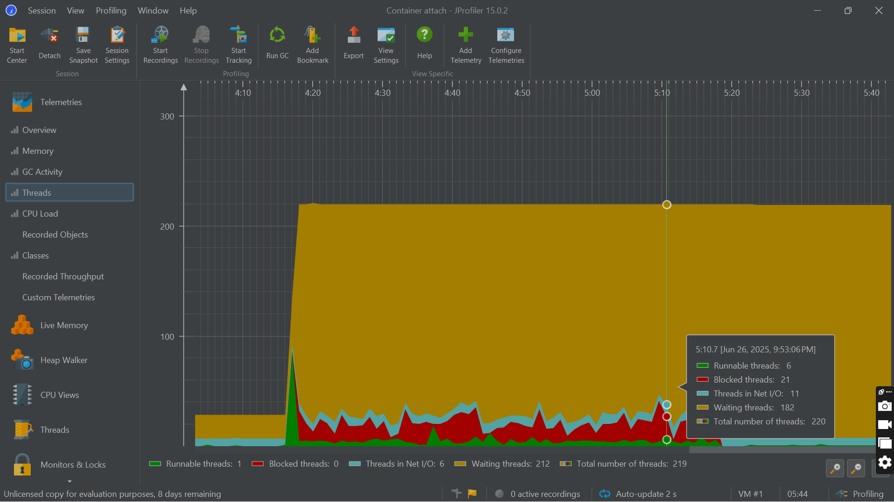

# Performance Optimization and Monitoring of Tracker Boost

## 1. Initial Summary

### a. Project starts without hitting any endpoint

The JProfiler overview indicates that the application is running smoothly with no visible performance issues. Memory usage remains stable around 200MB, with no noticeable spikes or drops, suggesting there are no memory leaks. Garbage Collection (GC) activity stays at 0% throughout the profiling period, which implies that the application is not under memory pressure and no GC events were triggered. Thread activity is consistent, with approximately 40 threads active, and there are no signs of thread spikes, drops, or deadlocks. CPU load fluctuates moderately between 0% and 60%, typically staying below 30%, indicating a balanced workload with no CPU bottlenecks. Additionally, the recorded objects graph remains flat, showing controlled or minimal object creation. Overall, the application's runtime behavior appears healthy and well-optimized during the observed time frame.

## 2. Hitting the Endpoints

### a. GET /projects with 2000 requests

**Summary Report**

**Aggregate Report**

The load test demonstrates solid API performance with an **average response time of 638ms** and excellent **throughput of 189 requests/second**. The system maintained **0% error rate**, indicating perfect reliability under the test load. **Latency percentiles** reveal good performance distribution: 50% of requests completed in 482ms (median), 90% within 1491ms, 95% within 1861ms, and 99% within 2674ms. Response times ranged from a minimum of 12ms to a maximum of 6617ms, with a standard deviation of 621.73ms. The system processed an average of 277.09 KB of data received and 72.73 KB sent per second, with each request averaging 1501 bytes.

### b. POST /tasks

**Summary Report**

**Aggregate Report**

This load test demonstrates a great API performance with an **average response time of 574ms** (64ms faster than the previous test) and higher **throughput of 192.1 requests/second**. The system maintained a perfect **0% error rate**, showing excellent reliability. **Latency percentiles** show better performance distribution: 50% of requests completed in 397ms (median), 90% within 1363ms, 95% within 1784ms, and 99% within 2707ms - all significantly better than the previous test. Response times ranged from a minimum of 17ms to a maximum of 4292ms, with a standard deviation of 592.61ms. The system processed 113.60 KB of data received and 114.45 KB sent per second, with each request averaging 605.5 bytes.

### c. GET /users/{id}/tasks

**Summary Report**

**Aggregate Report**

This load test reveals concerning performance degradation with an **average response time of 3166ms** and dramatically reduced **throughput of only 49.0 requests/second**. Despite the poor performance, the system maintained **0% error rate**, indicating it continued to function without failures under stress. **Latency percentiles** show severe performance issues: 50% of requests took 2615ms (median), 90% required 6483ms, 95% needed 8240ms, and 99% took 12271ms to complete. Response times ranged from a minimum of 86ms to a maximum of 18339ms, with a very high standard deviation of 2694.14ms indicating highly inconsistent performance. The system processed 12626.29 KB of data received but only 19.52 KB sent per second, with each request averaging a massive 263881.0 bytes.

## 3. Performance Analysis

The application struggles badly when under heavy use. The CPU usage shoots up to 99%, and it stays that way for almost an hour, showing that the system is overwhelmed. Memory is also not handled well—garbage collection happens often (up to 4% of the time), and memory usage keeps going up and down, which means a lot of objects are being created and destroyed quickly. Thread usage is another problem: out of 220 threads, 182 are just waiting, 21 are stuck because of resource conflicts, and only 6 are actually doing work. This poor thread usage matches the test results from JMeter, which show slow response times (over 3 seconds on average) and low performance (only 49 requests per second). Even though there are no errors, the app clearly can't handle many users at once efficiently.

## After Optimization

### 1. GET /projects

**Summary Report**

**Aggregate Report**

This performance test of 3,000 HTTP requests shows excellent API performance with strong consistency. The API delivers an average response time of 269ms with a median of 181ms, indicating most requests are handled quite efficiently. The system maintains perfect reliability with 0% error rate while achieving a solid throughput of 405.4 requests per second. Response times are well-distributed with minimal variability (standard deviation of 284ms), ranging from an impressive 4ms minimum to a reasonable 1,387ms maximum. The percentile data shows good performance scaling - 90% of requests complete within 717ms, 95% within 835ms, and even 99% of requests finish within just over 1 second. Overall, this represents a well-optimized API that can handle moderate to high load effectively while maintaining consistent response times and complete reliability.

### 2. POST /tasks

**Summary Report**

**Aggregate Report**

This JMeter performance test of 2,000 HTTP requests shows solid overall performance with some concerning outliers. The API maintains perfect reliability with 0% error rate and delivers a reasonable average response time of 299ms with a good median of 194ms, indicating most requests are handled efficiently. The system achieves decent throughput at 248.4 requests/second with response times ranging from an excellent 14ms minimum to a problematic 2,267ms maximum (over 2 seconds). The standard deviation of 329.14ms suggests moderate variability in performance. The percentile distribution reveals acceptable performance for most users - 90% of requests complete within 733ms and 95% within 999ms, but the 99th percentile at 1,507ms means 1% of users still experience delays of over 1.5 seconds.

### 3. GET /user/{id}/tasks

**Summary Report**

*[Note: The document appears to end abruptly here with just the heading for the third endpoint after optimization]*